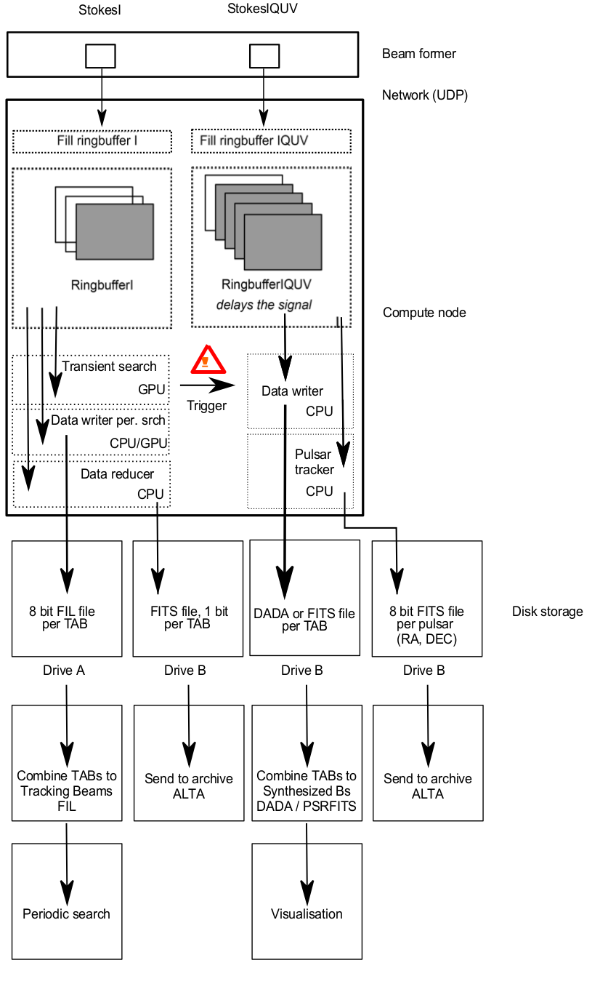

Dadatrigger
===========

This code is written for the AA-Alert project.
(c) 2017 Jisk Attema, Netherlands eScience Center, ASTRON

Based on the PSRdada software.

Initial version of data flow pipeline
=====================================

This is a work in progress; see the `start.sh` script.
Documentation and instructions coming soon(ish).

DADA header information
=======================

Meta data for the generated output is taken from various locations:
 * the FITS file templates
 * commandline arguemnts
 * DADA header blocks

The *start.sh* script should get most values from the system (via QPID?), generates the necessary dada headers, and passes commandline arguments.

The table below describes the required keys in the DADA headerblock:

| DADA header key      | used by         | standard name (QPID?) | description                  | Units   |
|----------------------|-----------------|---------------|------------------------------|---------|
| NCHAN                | filterbank, amber | NCHANNELS   | Number of frequency channels |    1    |
| MIN\_FREQUENCY       | filterbank, fits, amber |       | Lowest frequency             |         |
| CHANNEL\_BANDWIDTH   | filterbank, fits, amber |       | Bandwidth per channel        |         |
| BW                   | filterbank      |               | Total bandwidth              |         |
| TSAMP                | filterbank, amber       |       |                              |    s    |
| RA                   | filterbank      |               |                              |         |
| DEC                  | filterbank      |               |                              |         |
| SOURCE               | filterbank      |               | Name of the source           |    -    |
| AZ\_START            | filterbank      |               |                              |         |
| ZA\_START            | filterbank      |               |                              |         |
| MJD\_START           | filterbank      |               |                              |         |
| NBIT                 | filterbank      |               |                              |    1    |
| FILE\_SIZE           | dbdisk          |               | Expected final file size (?) |  bytes  |
| SAMPLES\_PER\_BATCH  | amber           |               | Normally 12500 or 25000      |    1    |
| UTC\_START           | dbevent, dbdisk |               | Start of the observation     | %Y-%m-%d-%H:%M:%S (UTC) |
| RESOLUTION           | dbevent         | | Page size (events are an integer mulitple of this) |  bytes  |
| BYTES\_PER\_SECOND   | dbevent         | | Data rate                                          |  bytes  |

TODO:

 * MIN\_FREQUENCY, CHANNEL\_BANDWIDTH, NCHAN, TSAMP, NBIT are all constant per experiment (ie. defined as part of the science case and mode). Having them as a parameter here is confusing, because changing it here will at most crash the codes; it will not do what you want.
 * Link stuff to QPID
 * Are we missing keys?

